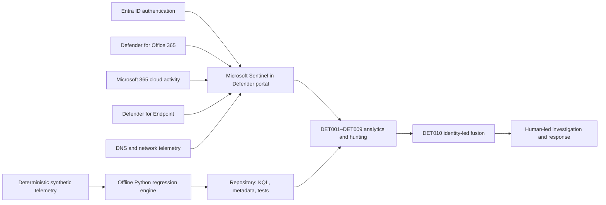

# Microsoft Sentinel Detection Engineering & Incident Fusion Lab

**Identity-led cloud intrusion detection across Microsoft Sentinel, Microsoft Defender XDR, Entra ID, endpoint, email, and cloud activity telemetry.**

[](https://github.com/mchandra452/CyberMahi/actions/workflows/sentinel-soclab-ci.yml)

## Executive overview

This defensive lab models a multi-source investigation at fictional Northbridge Financial Services. Ten repository-managed detections connect a delivered phishing link, password spray, risky account use, OAuth consent, external mailbox forwarding, unusual cloud downloads, an inert Office-to-PowerShell process event, and rare DNS activity. A deterministic Python engine validates detection intent offline while the KQL and metadata remain ready for tenant-specific testing in Microsoft Sentinel through the Microsoft Defender portal.

The project demonstrates hands-on detection engineering, threat hunting, correlation, regression testing, and incident response without claiming production deployment or live-tenant coverage.

## Engineering capabilities

- Ten commented KQL detections with thresholds, bounded windows, entity mappings, ATT&CK evidence, tuning, and test cases.
- 73 stable JSON Lines events, including four explicit benign controls and an intentionally accepted rare-domain false positive.
- Duplicate-aware incident fusion using configurable weights and independent signal categories.
- Offline validation, analysis, synthetic detection regression, deterministic evidence generation, and report building.
- Pytest, Ruff, secure GitHub Actions, safe-indicator enforcement, secret-pattern checks, and internal-link validation.

## Architecture



See [architecture](docs/architecture.md) and [attack path](docs/attack-path.md) for boundaries and evidence flow.

## Intrusion scenario

The primary scenario is **Identity Compromise and Cloud Persistence Investigation**. It starts with a Microsoft 365-themed synthetic message and ends with correlated identity, cloud, mailbox, endpoint, and DNS evidence. Four benign controls—corporate VPN travel, service-account failures, approved administrator consent, and backup downloads—test tuning. Events use reserved domains and documentation IP ranges only.

## Detection catalog

| ID | Detection | Signal | Severity | Confidence |
|---|---|---|---|---|
| DET001 | Password Spray Across Cloud Accounts | Entra authentication | Medium | High |
| DET002 | Successful Authentication After Failure Burst | Entra authentication | High | High |
| DET003 | Unusual Authentication Context | Entra + baseline | Medium | Medium |
| DET004 | Phishing-Link Indicators | Email + URL | Medium | High |
| DET005 | Suspicious OAuth Consent | Entra audit | High | Medium |
| DET006 | External Mail Forwarding Rule | Exchange audit | High | High |
| DET007 | Cloud Download Anomaly | Cloud files + baseline | Medium | Medium |
| DET008 | Office Application Spawning PowerShell | Endpoint process | High | High |
| DET009 | New or Rare Domain DNS Activity | Endpoint network | Low | Medium |
| DET010 | Identity-Led Incident Fusion | Correlated alerts | High | High |

Full assumptions and test status are in the [detection catalog](docs/detection-catalog.md).

## Offline quick start

Python 3.11 or newer is required. The Python equivalents test intent against synthetic data; they do not execute KQL.

Linux/macOS:

```bash
git clone https://github.com/mchandra452/CyberMahi.git
cd CyberMahi/sentinel-soc-investigation-lab
python3 -m venv .venv
source .venv/bin/activate
python -m pip install --upgrade pip
python -m pip install -e ".[dev]"
python -m soclab validate
python -m soclab analyze
python -m soclab test-detections
python -m soclab build-report
pytest
```

Windows PowerShell:

```powershell
git clone https://github.com/mchandra452/CyberMahi.git
Set-Location CyberMahi\sentinel-soc-investigation-lab
py -m venv .venv
.venv\Scripts\Activate.ps1
python -m pip install --upgrade pip
python -m pip install -e ".[dev]"
python -m soclab validate
python -m soclab analyze
python -m soclab test-detections
python -m soclab build-report
pytest
```

Make targets call the same commands without hiding failures:

```bash
make validate
make analyze
make test
make report
make all
```

## Example output

The committed [analysis summary](artifacts/example/analysis-summary.md) and related evidence are generated from the fixture rather than written independently. A verified run produces:

```text
Incident: INC-NFS-2025-001
Risk: 99/100 (high severity, high confidence)
Linked detections: DET001-DET009
Synthetic regression: TP=10, FP=1, FN=0, precision=0.9091, recall=1.0000
```

The accepted benign DNS novelty case intentionally prevents a misleading claim of perfect precision. The report and timeline contain only findings that actually contributed to the incident; the accepted false positive remains visible in `findings.json` and metrics.

## Repository structure

```text
config/             lab policy, safe indicators, risk weights
data/               JSONL telemetry, baselines, expected labels
detections/kql/     native-table KQL queries
detections/rules/   analytics metadata and test cases
src/soclab/         offline engine and CLI
tests/              unit, integration, and repository checks
docs/               engineering, deployment, hunt, and response guides
artifacts/example/  deterministic generated evidence
.github/            project templates; active CI is at the monorepo root
```

## Sentinel deployment path

Use the [Sentinel deployment guide](docs/sentinel-deployment.md) to map fields, onboard connectors, test KQL, configure analytics/entity mapping, and validate incidents in the Microsoft Defender portal. Nothing in this repository deploys to or modifies a tenant.

## Evidence and testing

The [project status](docs/project-status.md), [methodology](docs/detection-engineering-methodology.md), [false-positive analysis](docs/false-positive-analysis.md), [coverage and gaps](docs/coverage-and-gaps.md), and [incident runbook](docs/incident-response-runbook.md) explain what is verified and what still needs live evidence. The monorepo-root CI workflow runs linting, pytest, validation, analysis, regression tests, report generation, and committed-example parity checks on Python 3.11 and 3.12.

## Limitations

- Source evidence is synthetic; no real organisation, victim, tenant, or incident is represented.
- Python tests implement equivalent intent but do not parse or run KQL.
- Live connector fields, data quality, retention, baselines, licensing, and costs vary by tenant.
- Domain reputation, publisher verification, device-signing enrichment, and user/session context are limited offline.
- Detection weights and thresholds are illustrative and require production tuning and governance.

## Defensive use

This repository is defensive-only. Suspicious process text is inert and redacted; all network indicators use reserved namespaces or documentation ranges. Review [SECURITY.md](SECURITY.md) before adding evidence or adapting automation.
