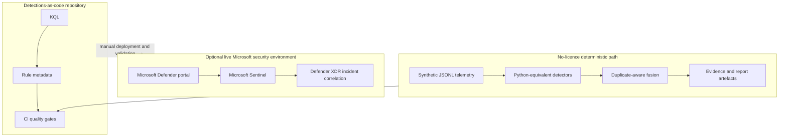

# Architecture

## Trust boundaries

Live and offline paths deliberately remain separate. CI verifies repository consistency, data safety, detection intent, fusion, and report generation. It cannot establish KQL syntax compatibility, connector readiness, rule scheduling behaviour, or production efficacy in a tenant.

## Data flow

Synthetic records use common identifiers and UTC timestamps across authentication, email, cloud application, endpoint process, and DNS sources. Detectors emit typed findings with event IDs and normalised account, IP, host, application, domain, URL, mailbox, and process context where available. [`data/telemetry/incidents.jsonl`](../data/telemetry/incidents.jsonl) is a synthetic reference record for the expected incident shape; it is not an input finding and does not declare an expected DET010 result.

Fusion retains one contribution per detection ID, requires the configured primary account and a four-hour temporal window, and requires at least four independent categories. It sums the unchanged per-detection weights, adds three points for each category above four, and caps the score at 100. A matching governed VPN IP subtracts 20 points and lowers confidence one level. High confidence requires at least six categories and seven unique detections. DET010 returns the union of evidence-bearing entity sets rather than only an account and one IP.

These values and the detection-to-category assignments are explicit in [`config/detection-risk-model.yml`](../config/detection-risk-model.yml) and mirrored in the deployable KQL because Sentinel cannot read the repository YAML at query time. The model is illustrative. Known VPNs, service accounts, approved consent actors, and backup identities are governed in baselines or watchlist-style constants rather than hidden detector assumptions.

## ASIM direction

Native Microsoft tables keep the KQL deployable and recognisable. Each authentication query includes an ASIM design note. A production iteration can move shared normalisation into `_Im_Authentication` and other ASIM parsers after validating local schema coverage, performance, and field fidelity.
