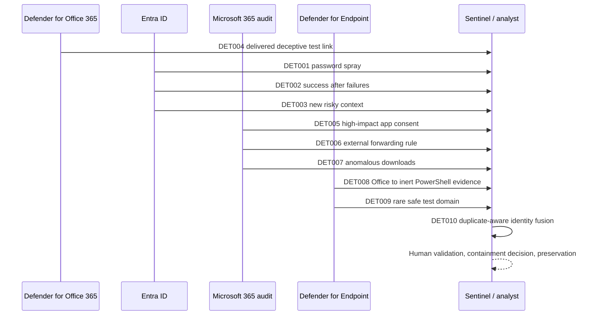

# Attack path and evidence chain

## Evidential interpretation

The sequence is a hypothesis supported by synthetic evidence, not an assertion that every step caused the next. Email delivery does not prove a click. Consent does not prove token theft. Download volume does not prove exfiltration. A rare domain is only a weak contextual signal. Confidence becomes high because several independent categories share the same account, device, source context, and bounded timeline.

## Benign controls

The same dataset contains approved VPN travel, repeated service-account failures, authorised administrator consent, and expected backup downloads. A newly adopted SaaS domain is intentionally reported as a benign false positive so the limits of novelty-only logic remain measurable.
