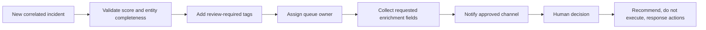

# Safe automation design

This design is non-deploying and performs no tenant mutation.

## Proposed steps

1. Tag the incident `identity-led`, `multi-source`, and `human-approval-required`.
2. Assign the configured SOC queue; do not infer an individual owner from fixture data.
3. Raise severity only when the configured score and independent-category threshold are met.
4. Attach requested enrichment fields for IP ownership, identity risk, application publisher, domain reputation, file sensitivity, and device health.
5. Send a notification containing the incident ID and evidence checklist, excluding raw sensitive fields.
6. Capture an evidence checklist for sign-ins, audit logs, email, mailbox, cloud files, process tree, DNS, and analyst actions.
7. Present recommendations for session revocation, identity disablement, mailbox-rule removal, and OAuth consent review.
8. Require an authorised human to approve, execute, and record any state-changing action.

## Failure handling

If enrichment fails, preserve the incident and mark the missing source; do not lower severity silently. If entity mapping is incomplete, route for manual triage. Automation must be idempotent so retried notifications or tags do not duplicate evidence or inflate risk.
